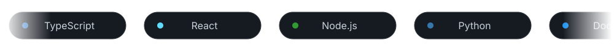

<!--
  Profile README — @renganathan07105
  ---------------------------------------------------------------
  [CI] sections are generated automatically by GitHub Actions:
    - profile/stats.svg, profile/top-langs.svg  -> .github/workflows/readme-stats.yml
    - metrics.svg                               -> .github/workflows/metrics.yml
    - dist/*.svg (snake)                        -> .github/workflows/snake.yml
  All GitHub statistics shown are real, live data. Nothing is fabricated.
  Edit freely — every external service below has been verified as maintained.
-->

  

<!-- Animated typing SVG -->

  

---

## 👨‍💻 About Me

I'm **Renganathan** — a software developer who enjoys turning ideas into clean, maintainable code. I care about simple design, well-structured systems, and shipping work I'm proud of. When I'm not coding, I'm usually learning something new or taking things apart to understand how they work.

- 🔭 I'm currently building full-stack web applications
- 🌱 I'm currently learning cloud-native architecture and DevOps
- 💬 Ask me about TypeScript, React, Node.js, and system design
- ⚡ Fun fact: the best code is the code that never needs a "sorry" comment

---

## 📊 GitHub Statistics

  
  

  

  

## 🏆 GitHub Trophies

  

---

## 🛠️ Tech Stack

  

### Programming Languages

  
  
  
  
  
  

### Frameworks & Libraries

  
  
  
  
  
  

### Databases

  
  

### Development Tools

  
  
  
  
  
  
  
  

### Operating Systems

  
  
  
  

---

## 🚀 Featured Projects

  <i>My projects are taking shape — everything I publish will be open source and linked right here.</i>

<!--
  Template — replace with real repositories as they are published.
  Use the official github-readme-stats-action (stats-organization/github-readme-stats-action@v2,
  card: pin) to generate pinned repo cards in CI — do not hotlink the vercel.app public instance.
-->

---

## 📈 Contribution Activity

  

## 📉 GitHub Metrics

  

## 🐍 Contribution Snake

  <picture>
    <source media="(prefers-color-scheme: dark)" srcset="./dist/github-snake-dark.svg">
    <source media="(prefers-color-scheme: light)" srcset="./dist/github-snake.svg">
    
  </picture>

  

## 🎯 Current Focus

- Building full-stack applications with TypeScript, React, and Node.js
- Designing clean APIs and efficient database schemas
- Shipping small, well-tested projects on a consistent cadence

## 📚 Currently Learning

- Cloud infrastructure and CI/CD — Docker, GitHub Actions, deployment pipelines
- System design and scalable architecture patterns
- Performance optimization and developer tooling

---

## 🤝 Connect With Me

  
  

<!-- Add more links here as they become available (LinkedIn, X/Twitter, Portfolio) -->

  

  

  

